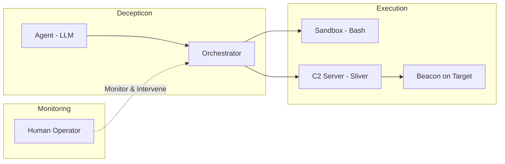

This documentation exists at a pivotal moment—right before Decepticon's **major refactoring**. After months of development and iterative learning, we have a clear picture of what works, what doesn't, and where the architecture needs to evolve. This page captures that vision.

<Note>
  This is a living document. The target architecture described here is at the **vision level**—it represents our current best thinking and will evolve as the refactoring progresses. Implementation details will be documented as they materialize.
</Note>

## Current Limitations

Before detailing the target architecture, it's important to be honest about the current system's constraints:

### Monolithic Agent Design
The current implementation runs as a single, large agent. While functional, this creates problems:
*   **Context Window Saturation**: A single agent handling reconnaissance, exploitation, and post-exploitation quickly exhausts its LLM context window.
*   **No Specialization**: One agent trying to be an expert at everything leads to mediocre performance across all phases.
*   **Difficult to Scale**: Adding new attack capabilities means modifying the monolithic agent, increasing complexity exponentially.

### Limited Persistence & State Management
*   **Session-Bound Memory**: The agent loses all context between sessions.
*   **No Long-Term Learning**: Insights from previous engagements don't carry over.
*   **Fragile State**: If the agent crashes mid-operation, recovery is difficult.

## Stealth-First Execution Architecture

Since Decepticon is fundamentally a **Red Team Testing** agent, stealth is not a feature—it's the architecture itself.

The whole point of Red Team Testing goes beyond finding vulnerabilities. It tests:
- **Can the Blue Team detect the intrusion?**
- **How quickly do they respond?**
- **What do they miss, and why?**

If the testing tool loudly announces itself, these questions become unanswerable. Decepticon's execution architecture is designed to operate exactly like a real attacker:

### C2-Based Communication
The agent communicates through **Command & Control (C2) infrastructure**—maintaining encrypted, covert channels just as real threat actors do. This isn't a simulation of stealth; it *is* stealth.

### Sandbox Command Execution
The agent executes commands within **sandboxed environments**, maintaining the operational security discipline that real adversaries practice:
*   **Direct Bash Execution**: The agent can execute shell commands directly within isolated sandbox environments.
*   **C2 Beacon Execution**: Commands can also flow through C2 beacons deployed on target systems, mimicking real implant behavior.
*   **Operational Security**: All execution paths are designed with detection evasion in mind—just as a real Red Team operator would.

## Multi-Agent Hybrid Architecture

The refactoring will transform Decepticon from a monolithic agent into a **coordinated multi-agent system** that blends LLM reasoning with proven security tools.

### Specialist Agents
Instead of one agent doing everything, specialized agents handle different phases of the operation:

<CardGroup cols={2}>
  <Card title="Recon Agent" icon="search">
    OSINT gathering, network mapping, service enumeration. Feeds intelligence to other agents.
  </Card>
  <Card title="Exploitation Agent" icon="bug">
    Vulnerability identification and exploitation. Uses LLM reasoning to craft context-aware payloads.
  </Card>
  <Card title="Post-Exploitation Agent" icon="network">
    Lateral movement, privilege escalation, persistence. Operates through C2 infrastructure.
  </Card>
  <Card title="Evasion Agent" icon="eye-off">
    Monitors Blue Team detection signals and adapts all agents' behavior to maintain stealth.
  </Card>
</CardGroup>

### Hybrid Tool Integration
Each specialist agent doesn't work alone—it orchestrates **legacy tools** alongside LLM-driven decision making:

*   **The Agent Decides**: Which tool to deploy, when, and how to interpret the results.
*   **The Tools Execute**: Fuzzers, scanners, payload generators—proven techniques that handle structured tasks with mechanical precision.
*   **The Agent Adapts**: Based on tool outputs, the agent reasons about next steps, pivots strategy, and chains actions into coherent attack sequences.

This is not "AI replaces everything." It's **AI as the strategist, tools as the specialists**.

## Human in the Loop

Decepticon places the human operator at the center of every operation—not as a passive observer, but as the **ultimate decision-maker**.

### Real-Time Visibility
Like modern AI agent services, operators have full visibility into what the agent is doing:
*   What action is being taken and why
*   What the agent plans to do next
*   The reasoning chain behind each decision

### Intervention at Any Moment
The operator can step in at any point during the operation:
*   **Pause** the operation to assess the situation
*   **Redirect** the agent's strategy based on human judgment
*   **Override** specific decisions when the agent's reasoning doesn't align with operational goals
*   **Provide feedback** that shapes the agent's subsequent behavior

<Info>
  The human isn't steering every turn—they're the commander watching the battlefield, ready to intervene when their judgment and experience are needed most.
</Info>

## Roadmap

The refactoring follows an iterative path, with each phase building on the previous:

<Steps>
  <Step title="Phase 1: Foundation">
    Core agent framework, LLM integration, and basic tool orchestration capabilities.
  </Step>
  <Step title="Phase 2: Stealth Execution">
    C2 integration (Sliver), sandbox execution environment, and covert communication channels.
  </Step>
  <Step title="Phase 3: Specialist Agents">
    Decompose the monolithic agent into specialized Recon, Exploitation, and Post-Exploitation agents.
  </Step>
  <Step title="Phase 4: Human in the Loop">
    Real-time monitoring dashboard, intervention controls, and feedback mechanisms.
  </Step>
  <Step title="Phase 5: Orchestration & Learning">
    Multi-agent coordination, shared knowledge base, and cross-session learning.
  </Step>
</Steps>

<Info>
  This roadmap is not linear—phases overlap and inform each other. The refactoring is an iterative process, much like the offensive operations Decepticon itself performs.
</Info>
