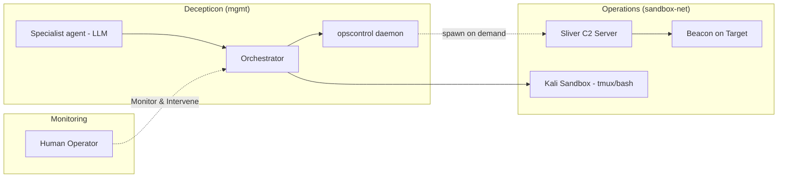

This page used to describe a future refactoring. The refactoring is **done**. What follows is the architectural target as it stands today, plus the horizons we're still climbing toward.

<Note>
  Living document. The shipped architecture below is current at the time of writing. The "What's Next" section describes ongoing direction, not commitments.
</Note>

## What We Solved

The original monolithic agent design ran into three structural ceilings:

- **Context window saturation** — one agent juggling recon, exploitation, and post-exploit ran out of context before completing a serious engagement.
- **No specialization** — a generalist made shallow decisions on every phase.
- **Session-bound memory** — knowledge died at the end of every run; nothing carried over.

Decepticon's current architecture closes each of those gaps explicitly.

## Multi-Agent Hybrid Architecture (Shipped)

A single orchestrator (`decepticon`) plans the engagement and dispatches **fresh-context specialist sub-agents** through SubAgent middleware. Each specialist receives only the slice of state it needs and writes findings back to the knowledge graph and disk before exiting.

<CardGroup cols={2}>
  <Card title="Orchestrators" icon="brain">
    `decepticon` (main red-team coordinator), `vulnresearch` (5-stage vulnerability pipeline), `soundwave` (standalone engagement planner — generates RoE, ConOps, OPPLAN).
  </Card>
  <Card title="Specialist roster" icon="users">
    Recon, Exploit, Post-Exploit, AD Operator, Cloud Hunter, Contract Auditor, Reverser, Analyst, plus extended operators (phisher, mobile, wireless, IoT, ICS, forensicator, supply-chain, OSINT) for niche domains.
  </Card>
  <Card title="Vulnresearch pipeline" icon="rotate">
    Scanner → Detector → Verifier → Patcher → Exploiter. The Patcher writes a fix; the Exploiter then tries to break it. State passes between stages through the knowledge graph, not through context.
  </Card>
  <Card title="Plugin bundles" icon="plug">
    The standard bundle ships in OSS; extra capabilities (vulnresearch, SaaS, third-party plugins) attach via entry points without forking the core.
  </Card>
</CardGroup>

### Hybrid Tool Integration

Each specialist orchestrates **proven security tools** alongside LLM reasoning:

- **The agent decides** which tool to deploy, when, and how to interpret the results.
- **The tools execute** — nmap, BloodHound, Slither, Sliver, sqlmap, ghidra — proven techniques that handle structured work with mechanical precision.
- **The agent adapts** based on tool output, reasons about next steps, and chains actions into coherent attack sequences.

This is not "AI replaces everything." It's **AI as the strategist, tools as the specialists**.

## Stealth-First Execution Architecture (Shipped)

Decepticon is a Red Team agent — stealth is the architecture itself. The whole point of Red Team Testing goes beyond finding vulnerabilities: can the Blue Team detect the intrusion? How quickly do they respond? What do they miss, and why? If the testing tool loudly announces itself, those questions become unanswerable.

The shipped execution path mirrors a real adversary:

- **Sandbox execution** — All bash flows through a persistent tmux-backed Kali sandbox on an isolated `sandbox-net` Docker network. The orchestrator reaches the sandbox over the Docker socket — never the network. No management traffic ever crosses into operations.
- **Dynamic infrastructure** — Heavyweight workloads (Sliver C2, BloodHound, future Havoc / Mythic) are not booted by default. The agent calls `ops_start("c2-sliver")` and a per-user **opscontrol daemon** brings the workload up on demand via Compose profiles. See [Dynamic Infrastructure](/en/features/dynamic-infrastructure).
- **C2-based communication** — When operations require it, the agent issues commands through Sliver C2 beacons exactly as a human operator would, maintaining the encrypted covert channels real threat actors use.

```mermaid
graph LR
    subgraph Decepticon ["Decepticon (mgmt)"]
        A[Specialist agent - LLM] --> O[Orchestrator]
        O --> OPS[opscontrol daemon]
    end

    subgraph Execution ["Operations (sandbox-net)"]
        OPS -.->|spawn on demand| C[Sliver C2 Server]
        O --> S[Kali Sandbox - tmux/bash]
        C --> B[Beacon on Target]
    end

    subgraph Monitoring
        H[Human Operator] -.->|Monitor & Intervene| O
    end
```

## Knowledge Graph as Shared Memory (Shipped)

Across-session memory is solved by a **Neo4j-backed knowledge graph**, owned by `KGMiddleware`. Specialists call explicit `kg_record` / `kg_ingest` tools; the middleware enforces engagement-scope isolation so two parallel engagements never bleed into each other.

- **Findings persist** between specialist invocations — Stage 4 of vulnresearch reads candidates Stage 1 emitted without ever sharing context.
- **Multi-hop reasoning** — Analyst queries the graph to construct exploit chains that span multiple agents' work.
- **Engagement scoping** — Every node is tagged with `engagement`. Tenants are isolated by composite `(key, engagement)` uniqueness at the schema level.

## Human in the Loop (Shipped)

The operator is the ultimate decision-maker. The HITL middleware wires LangGraph's native interrupt pattern so the agent can pause for approval on consequential actions:

- **Real-time visibility** — Operators see every tool call, its reasoning, and what the agent plans next, streamed over SSE.
- **Intervention at any moment** — Pause to assess, redirect strategy, override specific decisions, or provide feedback that shapes subsequent behavior.
- **Approval gates** — Actions touching production or with high blast radius prompt before executing.

<Info>
  The human isn't steering every turn — they're the commander watching the battlefield, ready to intervene when their judgment and experience are needed most.
</Info>

## What's Next

The shipped architecture is solid. Open horizons:

<Steps>
  <Step title="Offensive Vaccine — closing the defensive loop">
    `blue_cell` (defense agent) is in OSS today. The next horizon is the full attack → defend → verify loop: red findings drive blue patches, blue patches re-run the red path, and the delta is published as a vaccine signature.
  </Step>
  <Step title="Cross-engagement learning">
    Engagement-scoped graphs are the baseline. The next layer is anonymized cross-engagement signals — "this RCE pattern has been seen in three other engagements" — without violating tenant isolation.
  </Step>
  <Step title="Plugin economy">
    Standard + vulnresearch bundles ship today. SDK is published; the next step is a community plugin registry so third-party operators (DFIR teams, bug-bounty automators, mobile specialists) extend Decepticon without forking core.
  </Step>
  <Step title="Multi-stack federation">
    `DECEPTICON_STACK_NAME` already supports multiple stacks on one host. Federation across hosts (one orchestrator, sandboxes in many regions) is the next scaling axis for distributed engagements.
  </Step>
</Steps>

<Info>
  This roadmap is not linear — horizons overlap and inform each other. The architecture is an iterative process, much like the offensive operations Decepticon itself performs.
</Info>
