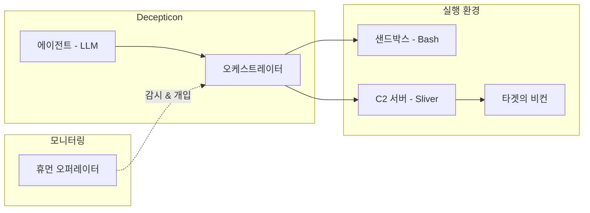

이 문서는 Decepticon의 **전면 리팩토링** 직전이라는 중대한 시점에 존재합니다. 수개월의 개발과 반복적인 학습을 거치며, 우리는 무엇이 작동하고, 무엇이 작동하지 않으며, 아키텍처가 어디로 진화해야 하는지 명확한 그림을 갖게 되었습니다. 이 페이지는 그 비전을 기록합니다.

<Note>
  이것은 살아있는 문서입니다. 여기 서술된 목표 아키텍처는 **비전 레벨**로, 현재 시점의 최선의 판단을 나타내며, 리팩토링이 진행됨에 따라 함께 진화할 것입니다. 구현 세부사항은 실제 구현이 이루어짐에 따라 문서화될 예정입니다.
</Note>

## 현재의 한계점

목표 아키텍처를 상세히 설명하기 전에, 현재 시스템의 제약을 솔직하게 인정하는 것이 중요합니다:

### 모놀리식 에이전트 설계
현재 구현은 하나의 대형 에이전트로 실행됩니다. 작동은 하지만, 여러 문제를 야기합니다:
*   **컨텍스트 윈도우 포화**: 정찰, 익스플로잇, 포스트-익스플로잇을 모두 처리하는 단일 에이전트는 LLM의 컨텍스트 윈도우를 빠르게 소진합니다.
*   **전문성 부재**: 모든 것에 전문가이려는 하나의 에이전트는 모든 단계에서 평범한 성능을 보입니다.
*   **확장의 어려움**: 새로운 공격 역량을 추가하려면 모놀리식 에이전트를 수정해야 하며, 복잡도가 기하급수적으로 증가합니다.

### 제한된 지속성 & 상태 관리
*   **세션 종속 메모리**: 에이전트가 세션 간에 모든 컨텍스트를 잃어버립니다.
*   **장기 학습 불가**: 이전 교전에서 얻은 인사이트가 다음으로 이어지지 않습니다.
*   **취약한 상태**: 에이전트가 작전 중 크래시되면, 복구가 어렵습니다.

## 스텔스 중심 실행 아키텍처

Decepticon은 근본적으로 **레드팀 테스팅** 에이전트이기에, 은닉은 기능이 아니라 아키텍처 자체입니다.

레드팀 테스팅의 핵심은 취약점을 찾는 것을 넘어섭니다. 이것이 테스트하는 것은:
- **블루팀이 침입을 탐지할 수 있는가?**
- **얼마나 빨리 대응하는가?**
- **무엇을 놓치며, 왜 놓치는가?**

테스팅 도구가 스스로를 시끄럽게 공표한다면, 이 질문들은 답할 수 없게 됩니다. Decepticon의 실행 아키텍처는 실제 공격자와 동일하게 운영되도록 설계되었습니다:

### C2 기반 통신
에이전트는 **C2(Command & Control) 인프라**를 통해 통신하며, 실제 위협 행위자와 동일하게 암호화된 은밀한 채널을 유지합니다. 이것은 은닉의 시뮬레이션이 아니라, 은닉 *그 자체*입니다.

### 샌드박스 명령어 실행
에이전트는 **샌드박스 환경** 내에서 명령어를 실행하며, 실제 적들이 실천하는 작전 보안(OPSEC) 규율을 유지합니다:
*   **직접 Bash 실행**: 에이전트는 격리된 샌드박스 환경 내에서 셸 명령어를 직접 실행할 수 있습니다.
*   **C2 비컨 실행**: 타겟 시스템에 배포된 C2 비컨을 통해서도 명령어가 흐를 수 있으며, 실제 임플란트 동작을 모방합니다.
*   **작전 보안 (OPSEC)**: 모든 실행 경로는 탐지 우회를 염두에 두고 설계됩니다—실제 레드팀 오퍼레이터가 그러하듯.

## 멀티-에이전트 하이브리드 아키텍처

리팩토링은 Decepticon을 모놀리식 에이전트에서, LLM 추론과 검증된 보안 도구를 결합한 **조율된 멀티-에이전트 시스템**으로 변환할 것입니다.

### 전문 에이전트 (Specialist Agents)
하나의 에이전트가 모든 것을 하는 대신, 전문화된 에이전트들이 작전의 각 단계를 담당합니다:

<CardGroup cols={2}>
  <Card title="정찰 에이전트" icon="search">
    OSINT 수집, 네트워크 매핑, 서비스 열거. 수집한 인텔리전스를 다른 에이전트에게 공급합니다.
  </Card>
  <Card title="익스플로잇 에이전트" icon="bug">
    취약점 식별과 공격 수행. LLM 추론을 활용하여 문맥 인식 페이로드를 제작합니다.
  </Card>
  <Card title="포스트-익스플로잇 에이전트" icon="network">
    횡적 이동, 권한 상승, 지속성 확보. C2 인프라를 통해 운영됩니다.
  </Card>
  <Card title="우회 에이전트" icon="eye-off">
    블루팀의 탐지 신호를 모니터링하고 은닉을 유지하기 위해 모든 에이전트의 행동을 적응시킵니다.
  </Card>
</CardGroup>

### 하이브리드 도구 통합
각 전문 에이전트는 혼자 일하지 않습니다—LLM 기반 의사결정과 함께 **레거시 도구들**을 조율합니다:

*   **에이전트가 결정**: 어떤 도구를 언제, 어떻게 배포하고, 결과를 어떻게 해석할지.
*   **도구가 실행**: 퍼저, 스캐너, 페이로드 생성기—구조화된 작업을 기계적 정밀함으로 처리하는 검증된 기법들.
*   **에이전트가 적응**: 도구의 출력을 기반으로 다음 단계를 추론하고, 전략을 피벗하며, 행동들을 일관된 공격 시퀀스로 체이닝합니다.

이것은 "AI가 모든 것을 대체한다"가 아닙니다. **AI는 전략가, 도구는 전문가**입니다.

## 사람이 중심에 서다 (Human in the Loop)

Decepticon은 인간 오퍼레이터를 모든 작전의 중심에 위치시킵니다—수동적 관찰자가 아닌, **궁극적 의사결정자**로서.

### 실시간 가시성
현대의 AI 에이전트 서비스처럼, 오퍼레이터는 에이전트가 하는 일에 대한 완전한 가시성을 갖습니다:
*   어떤 액션이 취해지고 있으며 왜 그런지
*   에이전트가 다음에 무엇을 할 계획인지
*   각 결정 뒤의 추론 체인

### 언제든 개입 가능
오퍼레이터는 작전 중 어떤 시점에서든 개입할 수 있습니다:
*   상황을 평가하기 위해 작전을 **일시정지**
*   인간의 판단에 기반하여 에이전트의 전략을 **방향 전환**
*   에이전트의 추론이 작전 목표와 맞지 않을 때 특정 결정을 **직접 개입**
*   에이전트의 후속 행동을 형성하는 **피드백 제공**

<Info>
  사람은 매 커브를 직접 운전하는 것이 아닙니다—전장을 관찰하는 지휘관으로서, 자신의 판단과 경험이 가장 필요한 순간에 개입할 준비가 되어 있습니다.
</Info>

## 로드맵

리팩토링은 각 단계가 이전 단계 위에 구축되는 반복적 경로를 따릅니다:

<Steps>
  <Step title="Phase 1: 기반 구축">
    핵심 에이전트 프레임워크, LLM 통합, 기본 도구 오케스트레이션 역량.
  </Step>
  <Step title="Phase 2: 스텔스 실행">
    C2 통합 (Sliver), 샌드박스 실행 환경, 은밀한 통신 채널.
  </Step>
  <Step title="Phase 3: 전문 에이전트">
    모놀리식 에이전트를 정찰, 익스플로잇, 포스트-익스플로잇 전문 에이전트로 분해.
  </Step>
  <Step title="Phase 4: Human in the Loop">
    실시간 모니터링 대시보드, 개입 컨트롤, 피드백 메커니즘.
  </Step>
  <Step title="Phase 5: 오케스트레이션 & 학습">
    멀티-에이전트 조율, 공유 지식 베이스, 크로스-세션 학습.
  </Step>
</Steps>

<Info>
  이 로드맵은 선형적이지 않습니다—각 단계는 서로 겹치고 영향을 주고 받습니다. 리팩토링은 Decepticon 자체가 수행하는 오펜시브 작전처럼, 반복적인 프로세스입니다.
</Info>
