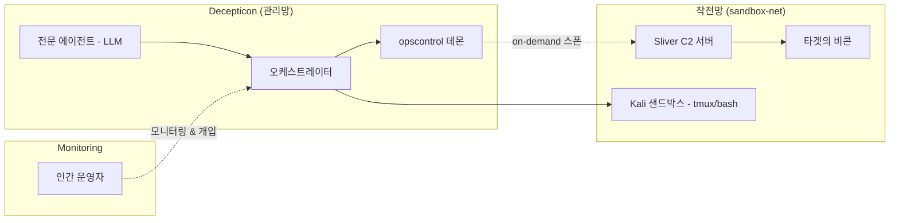

이 페이지는 한때 미래 리팩토링을 설명했습니다. 그 리팩토링은 **완료되었습니다**. 아래는 현재 시점의 아키텍처 목표와, 아직 오르고 있는 다음 지평선들입니다.

<Note>
  살아있는 문서. 아래 적힌 shipped 아키텍처는 작성 시점 기준으로 현재 사양입니다. "다음 단계" 섹션은 진행 중인 방향이며, 약속이 아닙니다.
</Note>

## 무엇을 해결했는가

기존 모놀리식 에이전트 설계는 세 가지 구조적 한계에 부딪쳤습니다:

- **컨텍스트 윈도우 포화** — 정찰, 익스플로잇, 포스트 익스플로잇을 한 에이전트가 모두 다루다 보면 진지한 인게이지먼트를 완수하기 전에 컨텍스트가 고갈됩니다.
- **전문성 부재** — 모든 단계의 전문가가 되려는 제너럴리스트는 단계마다 얕은 결정을 내립니다.
- **세션 한정 메모리** — 매 실행 종료 시점에 지식이 사라져 다음 실행으로 이어지지 않습니다.

현재 Decepticon 아키텍처는 이 세 가지 격차를 명시적으로 닫습니다.

## 멀티 에이전트 하이브리드 아키텍처 (Shipped)

단일 오케스트레이터(`decepticon`)가 인게이지먼트를 계획하고 **신선한 컨텍스트의 전문 서브 에이전트**들을 SubAgent 미들웨어를 통해 디스패치합니다. 각 전문가는 필요한 상태 조각만 받아 발견 사항을 지식 그래프와 디스크에 기록한 뒤 종료합니다.

<CardGroup cols={2}>
  <Card title="오케스트레이터" icon="brain">
    `decepticon` (메인 레드팀 조율자), `vulnresearch` (5단계 취약점 파이프라인), `soundwave` (독립형 인게이지먼트 플래너 — RoE, ConOps, OPPLAN 생성).
  </Card>
  <Card title="전문가 로스터" icon="users">
    Recon, Exploit, Post-Exploit, AD Operator, Cloud Hunter, Contract Auditor, Reverser, Analyst — 그리고 확장 운영자(phisher, mobile, wireless, IoT, ICS, forensicator, supply-chain, OSINT) — 특수 도메인용.
  </Card>
  <Card title="Vulnresearch 파이프라인" icon="rotate">
    Scanner → Detector → Verifier → Patcher → Exploiter. Patcher가 fix를 작성하면 Exploiter가 그 패치를 깨려 시도합니다. 단계 간 상태는 컨텍스트가 아니라 지식 그래프로 전달.
  </Card>
  <Card title="플러그인 번들" icon="plug">
    Standard 번들은 OSS에 기본 포함. 추가 기능(vulnresearch, SaaS, 서드파티 플러그인)은 코어 포크 없이 엔트리 포인트로 부착.
  </Card>
</CardGroup>

### 하이브리드 도구 통합

각 전문가는 **검증된 보안 도구**를 LLM 추론과 함께 조율합니다:

- **에이전트가 결정** — 어떤 도구를, 언제, 어떻게 해석할지.
- **도구가 실행** — nmap, BloodHound, Slither, Sliver, sqlmap, ghidra — 구조화된 작업을 기계적으로 처리하는 검증된 기법들.
- **에이전트가 적응** — 도구 출력에 기반해 다음 단계를 추론하고 전략을 피벗하며 행동을 일관된 공격 시퀀스로 연결.

"AI가 모든 것을 대체한다"가 아닙니다. **AI는 전략가, 도구는 전문가**입니다.

## 스텔스 우선 실행 아키텍처 (Shipped)

Decepticon은 레드팀 에이전트입니다 — 스텔스는 아키텍처 그 자체입니다. 레드팀 테스팅의 핵심은 취약점 발견 그 이상입니다: 블루팀은 침입을 탐지할 수 있는가? 얼마나 빨리 대응하는가? 무엇을 놓치며 왜 놓치는가? 테스팅 도구가 시끄럽게 자신을 광고한다면 이 질문들에 답할 수 없습니다.

Shipped된 실행 경로는 실제 공격자를 미러링합니다:

- **샌드박스 실행** — 모든 bash는 격리된 `sandbox-net` Docker 네트워크 위의 영속적 tmux 기반 Kali 샌드박스를 통해 흐릅니다. 오케스트레이터는 Docker 소켓으로 샌드박스에 도달하며 — 네트워크가 아닙니다. 관리 트래픽은 절대 작전망을 넘지 않습니다.
- **동적 인프라** — 헤비웨이트 워크로드(Sliver C2, BloodHound, 향후 Havoc / Mythic)는 기본 부팅되지 않습니다. 에이전트가 `ops_start("c2-sliver")`를 호출하면 사용자당 **opscontrol 데몬**이 Compose 프로파일로 워크로드를 즉시 기동합니다. [동적 인프라](/ko/features/dynamic-infrastructure) 참조.
- **C2 기반 통신** — 작전이 요구할 때 에이전트는 Sliver C2 비콘을 통해 명령을 전달하며, 실제 위협 행위자가 사용하는 암호화된 은밀 채널을 유지합니다.

```mermaid
graph LR
    subgraph Decepticon ["Decepticon (관리망)"]
        A[전문 에이전트 - LLM] --> O[오케스트레이터]
        O --> OPS[opscontrol 데몬]
    end

    subgraph Execution ["작전망 (sandbox-net)"]
        OPS -.->|on-demand 스폰| C[Sliver C2 서버]
        O --> S[Kali 샌드박스 - tmux/bash]
        C --> B[타겟의 비콘]
    end

    subgraph Monitoring
        H[인간 운영자] -.->|모니터링 & 개입| O
    end
```

## 공유 메모리로서의 지식 그래프 (Shipped)

세션을 가로지르는 메모리는 **Neo4j 기반 지식 그래프**로 해결되며, `KGMiddleware`가 소유합니다. 전문가는 명시적인 `kg_record` / `kg_ingest` 도구를 호출하고, 미들웨어가 인게이지먼트 범위 격리를 강제해 두 개의 병렬 인게이지먼트가 절대 섞이지 않게 합니다.

- **발견 사항이 영속** — vulnresearch의 4단계가 1단계가 발생시킨 후보를 컨텍스트 공유 없이 읽습니다.
- **다중 홉 추론** — Analyst가 그래프를 쿼리해 여러 에이전트의 작업을 가로지르는 익스플로잇 체인을 구성합니다.
- **인게이지먼트 스코핑** — 모든 노드에 `engagement` 태그. 스키마 레벨에서 복합 `(key, engagement)` 유니크니스로 테넌트가 격리됩니다.

## Human in the Loop (Shipped)

운영자는 궁극의 의사결정자입니다. HITL 미들웨어가 LangGraph 네이티브 interrupt 패턴을 연결해, 에이전트가 중요한 행동에서 승인을 기다리며 일시 정지할 수 있게 합니다:

- **실시간 가시성** — 모든 도구 호출, 그 추론, 다음 계획을 SSE로 스트리밍.
- **언제든 개입** — 상황 평가를 위한 일시 정지, 전략 리다이렉트, 특정 결정 오버라이드, 후속 행동을 형성하는 피드백 제공.
- **승인 게이트** — 프로덕션 영향이 있거나 폭발 반경이 큰 행동은 실행 전 승인 프롬프트.

<Info>
  사람은 매 턴을 조타하지 않습니다 — 그들은 전장을 지켜보다 자신의 판단과 경험이 가장 필요할 때 개입할 준비가 된 지휘관입니다.
</Info>

## 다음 단계

Shipped 아키텍처는 견고합니다. 열린 지평선:

<Steps>
  <Step title="Offensive Vaccine — 방어 루프 닫기">
    `blue_cell` (방어 에이전트)는 오늘 OSS에 있습니다. 다음 지평선은 완전한 공격 → 방어 → 검증 루프입니다: 레드 발견 사항이 블루 패치를 견인하고, 블루 패치는 레드 경로를 재실행하며, 그 델타가 백신 서명으로 게시됩니다.
  </Step>
  <Step title="인게이지먼트 간 학습">
    인게이지먼트 스코프 그래프가 기준선입니다. 다음 레이어는 테넌트 격리를 어기지 않으면서 익명화된 인게이지먼트 간 신호 — "이 RCE 패턴은 다른 세 개 인게이지먼트에서 관측됐다" — 를 노출하는 것입니다.
  </Step>
  <Step title="플러그인 생태계">
    Standard + vulnresearch 번들이 오늘 출하됩니다. SDK가 공개되었으며, 다음 단계는 커뮤니티 플러그인 레지스트리로 서드파티 운영자(DFIR 팀, 버그바운티 자동화, 모바일 전문가)가 코어 포크 없이 Decepticon을 확장하는 것입니다.
  </Step>
  <Step title="멀티 스택 페더레이션">
    `DECEPTICON_STACK_NAME`이 이미 한 호스트에서 다중 스택을 지원합니다. 호스트 간 페더레이션(오케스트레이터 하나, 여러 지역의 샌드박스)은 분산 인게이지먼트의 다음 스케일링 축입니다.
  </Step>
</Steps>

<Info>
  이 로드맵은 선형이 아닙니다 — 지평선들은 서로 겹치고 영향을 줍니다. 아키텍처는 Decepticon이 직접 수행하는 오펜시브 작전과 마찬가지로, 반복적인 프로세스입니다.
</Info>
